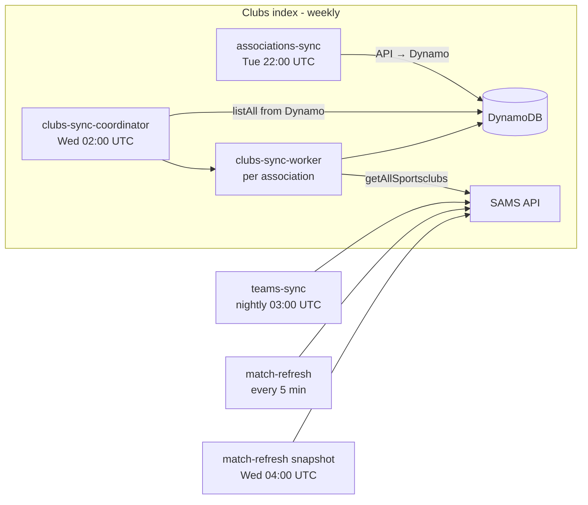
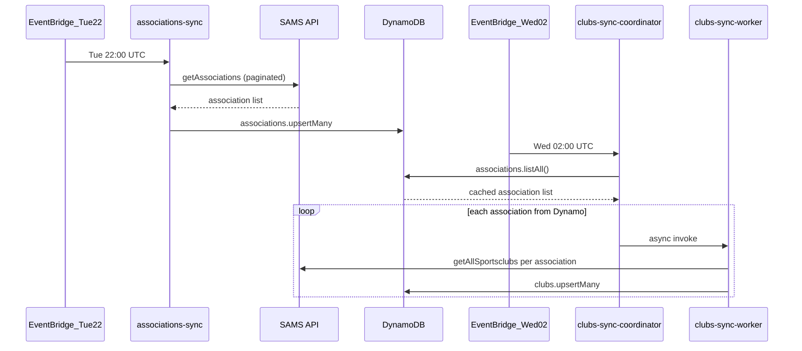

# Sync jobs

Maintainer reference for scheduled SAMS sync jobs. See also the **Runtime (clubs index)** section in [`CONTEXT.md`](../CONTEXT.md).

## Overview

| Job                          | Schedule (UTC)        | Lambda                   | CDK rule               |
| ---------------------------- | --------------------- | ------------------------ | ---------------------- |
| Associations refresh         | Tuesday 22:00         | `associations-sync`      | `AssociationsSyncRule` |
| Clubs fan-out                | Wednesday 02:00       | `clubs-sync-coordinator` | `ClubsSyncRule`        |
| Club fetch (per association) | On coordinator invoke | `clubs-sync-worker`      | —                      |
| Teams sync                   | Daily 03:00           | `teams-sync`             | `TeamsSyncRule`        |
| Match refresh                | Every 5 minutes       | `match-refresh`          | `MatchRefreshRule`     |
| Match/ranking snapshot       | Wednesday 04:00       | `match-refresh`          | `MatchSnapshotRule`    |

Register CLI (`vp run register`) resolves clubs from the DynamoDB index on demand and does not call SAMS.

## Clubs index sync

Associations and clubs are split across two weekly jobs. Club fan-out is driven by the **DynamoDB association index**, not the live SAMS API response from the same run. That makes club sync resilient when `getAssociations` intermittently omits entries: cached associations (730-day TTL) still receive workers.

### Sequence

### Data sources per step

| Step                     | Reads                                      | Writes                                                         |
| ------------------------ | ------------------------------------------ | -------------------------------------------------------------- |
| `associations-sync`      | SAMS `getAssociations`                     | Dynamo association rows                                        |
| `clubs-sync-coordinator` | Dynamo `associations.listAll()`            | Sync meta, `clubsSyncCompleted` event                          |
| `clubs-sync-worker`      | SAMS `getAllSportsclubs` (per association) | Dynamo club rows, `clubUpdated` events (registered clubs only) |

### Why Dynamo fan-out helps

When SAMS omits an association during Tuesday refresh, that association is not upserted that week, but an existing Dynamo row remains until TTL expiry. Wednesday club sync still fans out a worker for every cached association, so clubs under omitted associations continue to refresh.

Association names only update when SAMS includes the association during refresh. Names are used for worker payloads and stored club metadata; club data itself is always fetched live per worker.

### Bootstrap

On a fresh DynamoDB table with no associations:

1. Run `associations-sync` once (manually or wait for Tuesday 22:00 UTC).
2. `clubs-sync-coordinator` fans out from whatever is in Dynamo on the next Wednesday 02:00 UTC run.

**Prod** fails the clubs sync when the association index is empty (run `associations-sync` first). **Dev** completes successfully with zero workers so fresh feature deployments are not blocked before the first associations refresh.

## Match refresh modes

The same `match-refresh` Lambda runs two modes:

| Mode       | Schedule            | Behavior                                                                                         |
| ---------- | ------------------- | ------------------------------------------------------------------------------------------------ |
| `adaptive` | Every 5 minutes     | Polls only match blocks that are in the live window. Rankings ride along with those blocks.      |
| `snapshot` | Wednesday 04:00 UTC | Refetches the current-season schedule for every registered club and each related league ranking. |

Snapshot payload is `{ "mode": "snapshot" }`. The 5-minute rule sends a normal scheduled event (treated as adaptive). Newly registered clubs receive a full Spielplan and Tabelle on the next Wednesday snapshot without emptying the matches table.

## Sync meta job keys

| Job key                   | Lambda                            |
| ------------------------- | --------------------------------- |
| `associations`            | `associations-sync`               |
| `clubs-coordinator`       | `clubs-sync-coordinator`          |
| `clubs-{associationUuid}` | `clubs-sync-worker`               |
| `teams`                   | `teams-sync`                      |
| `match-refresh`           | `match-refresh` (adaptive)        |
| `match-snapshot`          | `match-refresh` (weekly snapshot) |

## Code map

| Concern                          | Location                                                                                                        |
| -------------------------------- | --------------------------------------------------------------------------------------------------------------- |
| Association refresh domain logic | [`src/sync/associations.ts`](../src/sync/associations.ts)                                                       |
| Club coordinator fan-out         | [`src/sync/clubs-coordinator.ts`](../src/sync/clubs-coordinator.ts)                                             |
| Per-association club sync        | [`src/sync/clubs.ts`](../src/sync/clubs.ts)                                                                     |
| Adaptive match refresh           | [`src/refresh/refresh-matches.ts`](../src/refresh/refresh-matches.ts)                                           |
| Match refresh planner            | [`src/refresh/planner.ts`](../src/refresh/planner.ts)                                                           |
| CDK schedules                    | [`lib/stacks/sync.ts`](../lib/stacks/sync.ts)                                                                   |
| Association Dynamo repository    | [`lib/db/repositories/sams-associations-repository.ts`](../lib/db/repositories/sams-associations-repository.ts) |
